Introduction
============

This User Guide proposes to describe the way the application should be used and all the functionalities that are available
within the application.

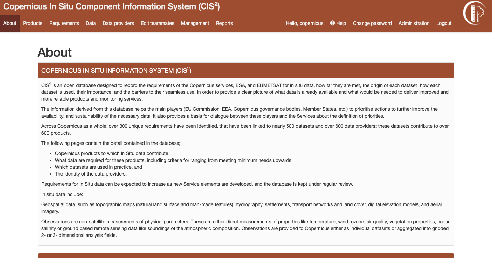

    *Main application page*

The first page, available at https://cis2.eea.europa.eu/, is the HomePage presented in *Figure 1*. The navigation menu is
available on the top of the page and it can be used to navigate to the listing pages of Products, Requirements, Data,
Data Providers, to make changes to the user’s account or to consult an online help page.

Database objects
================
The application holds the following main objects: Products, Requirements, Data, Data Provider. Those objects can have
multiple relations between one another. Besides those objects, there are many picklists tables which hold various values
to be used when defining an object.

----------
 Products
----------

    *Products listing page*

Listing products
----------------
Products listing page can be accessed from the link in the navigation bar. The listing can be filtered using the dropdown
options or by searching the products by their names. The filtered table can be exported then as a PDF or Excel document.

Creating new products
---------------------
A new product can be created by clicking the button “New product” from the listing page. The form must be completed
respecting the validation constraints.
A product can be added only by an **user with administration rights**.

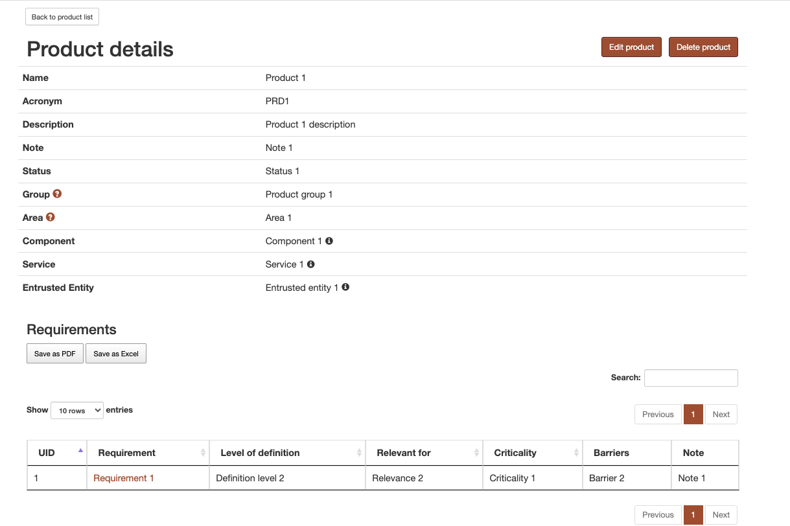

    *A product’s detail page*

Detail page of a product
------------------------
A product’s detail page can be accessed by clicking on the product’s name in the listing table. All information concerning
the product is displayed on this page. The table at the bottom of the page presents the requirements that product has a
relation with. By clicking on the requirement name, the requirement detail page can be seen. This table can be filtered
by searching the requirement’s name. It can also be exported as either PDF or Excel document.

Updating an existing product
----------------------------
A product can be edited by clicking on the “Edit Product” button from a product’s detail page. The form must again respect all validation constraints.
A product can be updated only by an **user with administration rights**.

Deleting a product
------------------
A product can be deleted by clicking on the “Delete Product” button from a product’s detail page. Another button must be clicked then to accept this change.
A product can be deleted only by an user with administration rights.

-----------
Requirement
-----------

    *Requirements listing page*

Listing requirements
--------------------
Requirements listing page can be accessed from the link in the navigation bar. The listing can be filtered using the
dropdown options or by searching the requirements by their names. The filtered table can be exported then as a PDF or
Excel document.
For metrics columns a legend explaining the values meaning can be accessed by hovering over the information button.

Creating new requirements
-------------------------
A new requirement can be created by clicking the button “New requirement” from the listing page. The form must be
completed respecting the validation constraints.
For requirement, a special validation is implemented. There must be no duplicated requirement. This means that in order
to create a new requirement, it must have at least one field(except for its name) which is different from another
requirement already in the database.

Cloning a requirement
---------------------
The clone option can be used if a new requirement to be created is very similar to one existing already in the application.
The cloning form can be accessed by going to the detail page of the similar requirement and clicking on the Clone button.
The form will be completed with data from the similar requirement. However, in order to save the new requirement, at
least one field must be changed (except the name field).

Detail page of a requirement
----------------------------
A requirement’ s detail page can be accessed by clicking on the requirement’s name in the listing table.
All information concerning the requirement is displayed on this page. The metrics information is explained when hovering
over the values.
There are two tables at the bottom of the page. Both tables can be filtered by name and then exported as PDF or as Excel.

**The first table concerns the relation with products**. All products with which the requirement has a relation with are
listed in this table.

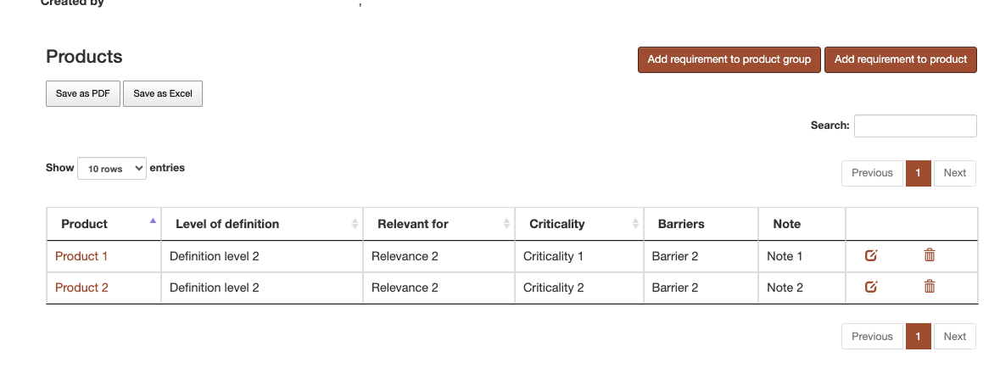

    *Requirement Products relation table*

Those relations must be unique, so between Product A and Requirement B there can be only a relation. There is an exception
to this rule in case the Relevance parameter is different.
There are two ways to  add a new relation to products.
First method is to click on the  “Add requirement to product” button and then complete a form in which you select the product
you want to use in that relation.
The second method is to click on the “Add requirement to product group” button. In the form a product group can be selected.
After form submission, relations will be created between the requirement and all the products that are in that product group.
A relation will be created only if a relation does not exist between that product and that requirement, following the Relevance
rule presented above.  The relations can also be edited or deleted using the buttons attached to each row in the table.

**The second table concerns the relation with data**. All data with which the requirement has a relation with is listed in
this table.

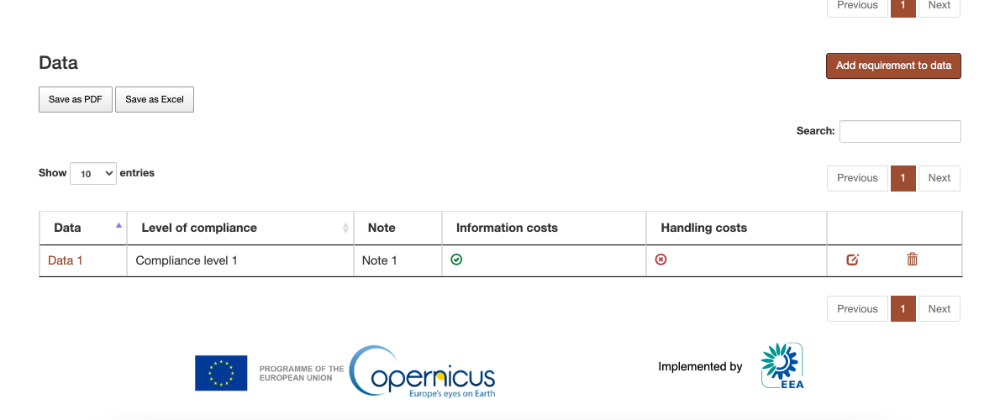

    *Requirement Data relation table*

Similar to the products, new relations between the requirement and data can be created. There must be a unique relation
between a requirement and a data. The relation can be edited or deleted using the buttons from the table.

Updating an existing requirement
--------------------------------
A requirement can be edited by clicking on the “Edit Requirement” button from a requirement’ s detail page. The form must
again respect all validation constraints, including the uniqueness of the requirements discussed in the Creating new
requirements section.

Deleting a requirement
----------------------
A requirement can be deleted by clicking on the “Delete Requirement” button from a requirement’ s detail page. Another
button must be clicked then to accept this change.

----
Data
----

    *Data Provider listing page*

Listing data
------------
Data listing page can be accessed from the link in the navigation bar. The listing can be filtered using the dropdown
options or by searching data by its name. The filtered table can be exported then as a PDF or Excel document.

    *Datalisting page*

Creating new data
-----------------
A new data can be created by clicking the button “New data” from the listing page.
The form which is initially accessed has no validation. This was decided in order to allow partial data to be created in
the application. However, if the user is sure about the data that he wants to introduce, he should use the form provided
in *Figure 8*.
There is a special validation rule for this form: at least an inspire theme or an essential variable.

Cloning a data
--------------
The clone option can be used if the new data is very similar to one existing already in the application. The cloning form
can be accessed by going to the detail page of the similar data and clicking on the Clone button. The form will be completed
with data from the similar data.

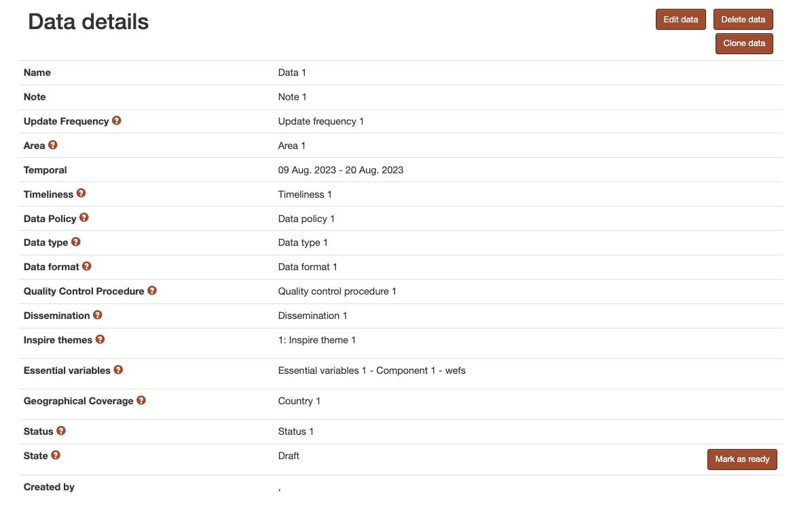

    *Data detail page*

Detail page of data
A data’ s detail page can be accessed by clicking on the data’s name in the listing table.
All information concerning the data is displayed on this page.
If that data is just partially completed, a warning message will be displayed on the top of the page with a link to the
editing page with full validation(*Figure 9*).

    *Data detail page relations*

There are two tables at the bottom of the page. Both tables can be filtered by name and then exported as PDF or as Excel.

**The first table concerns the relation with data provider**. All data providers with which the data has a relation with
are listed in this table.
Those relations must be unique, so between Data A and DataProvider B there can be only one relation. By clicking on the
button “Add data to data provider” and completing the form a new relation is added. The relation can be edited or deleted
using the buttons from the table.

**The second table concerns the relation with requirement**. All requirements with which the data has a relation with is
listed in this table. New relations can be created from requirement’ s page.

Updating an existing data
-------------------------
A data can be edited by clicking on the “Edit Data” button from a data’ s detail page. Similar to the creation of new data,
there are two forms: one with validation and one without.

Deleting data
-------------
Data can be deleted by clicking on the “Delete Requirement” button from a requirement’ s detail page. Another button must
be clicked then to accept this change.

-------------
Data provider
-------------

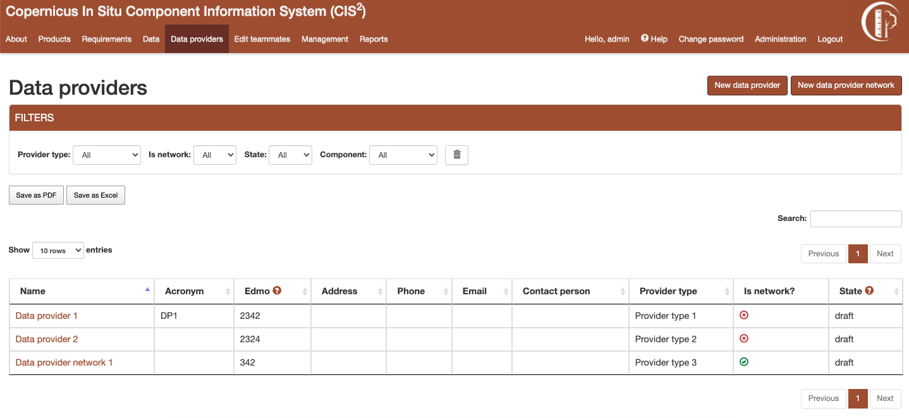

    *Data provider listing*

**There are two types of data providers: data provider network and data provider. The data provider network can have other**
**data providers or data provider networks as its members. This structure is defined as so to maintain a hierarchy between**
**data providers.**

Listing data provider
---------------------
Data provider listing page can be accessed from the link in the navigation bar. The listing can be filtered using the
dropdown options or by searching data by its name. The filtered table can be exported then as a PDF or Excel document.

Creating a new data provider
----------------------------
A new data provider can be created by clicking the button “New data provider” from the listing page.
A new data provider network can be created by clicking the button “New data provider network” from the listing page.

Detail page of data provider
----------------------------
A data provider’s detail page can be accessed by clicking on the data provider’s name in the listing table.

All information concerning the data provider is displayed on this page.
There is a tables at the bottom of the page.It can be filtered by name and then exported as PDF or as Excel.
**The table concerns the relation with data**. All data with which the data provider has a relation with is listed in
this table.

Updating an existing data provider
----------------------------------
A data provider can be edited by clicking on the “Edit Data Provider” button from a data provider’ s detail page.
Different forms are used for data provider/data provider network.

Edit network members
--------------------
A data provider network can have members. Its members can be edited by clicking on the “Edit network members”. A network
can’t be its own member.

Deleting data provider
----------------------
A data provider can be deleted by clicking on the “Delete Data provider” button from a data provider’ s detail page.
Another button must be clicked then to accept this change.

Users
=====
There are multiple types of users in the application:

**Administrator**

The administrator can modify everything in the application, without restriction. This type of user also has access to an
administrative pannel.

**Picklists Editor**

This user role allows a user to access a filtered version of the administrative pannel, for modifying the picklists.
This user is only allowed to add/edit the picklists.

**Product Editor**

This user role allows a user to add or edit the products, similar to the way requirements, data and data providers are edited.

**Regular Users**

The user is restricted from accessing the administration section, the management section and create, update or delete
any products.

The users have permission to edit or delete an object if they are the owner of it. Being the owner of an object means that
the object was created by that specific user.

**Read-Only User**

The read-only user is a user that is included in the Read-only Group. This type of user can only view the objects and create
and download reports, but they cannot add, edit or delete any information in the application.

    *Teammates editing form*

----------
User Teams
----------

A user can add other users to his team. Adding a user to one’s team gives that user permission to edit or delete all
objects created by that user. Once a user A adds another user B to his team, the user B will also have user A in their team.
A user can edit their teammates by accessing the edit teammates form from the navigation menu. Once a user sends a teammate
request, the other user will receive an email containing a link. Only after the link is clicked, the two users will become
teammates. (*Figure 12*)

----------------------
Change Password Option
----------------------

In case the account password was forgetten, the user can reset their password. An e-mail will be sent to the user's email account
with a reset password link. The user will then be able to set their new password.

Validation workflow
===================

Requirement, Data and Data Provider are all passing through a validation workflow.

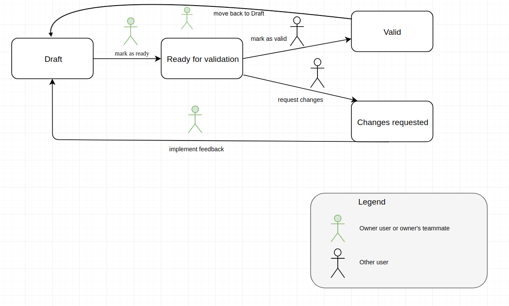

    *Workflow for Requirement, Data, Data Provider*

------
States
------
**Draft**

This is the state that the object has on its creation. In this state the object and its relations are editable. The owner
or one of their teammates can mark as ready the object.

**Ready for validation**

In this state the object and its relations cannot be edited. A user different from the owner or their teammates can either
mark as valid the object and end the workflow or request changes if that user considers that there is missing information.

**Changes requested**

In this state the object and its relations cannot be edited. The owner or one of their teammates can get the object back
to the draft state.

When an object's state is changed into "changes requested", the user requesting the changes can complete a feedback field in which they
inform the owner of the object about the changes that should be made (*Figure 14*). The owner receives an e-mail
that their object has requests for changes, the user that made those requests and what changes the user requested (from the feedback field).
The users in the application can see this feedback when the object is in state "Changes requested" or "Draft" on the detail page of the object
(*Figure 15*)

    *Request changes feedback field example*

    *Example of display of a feedback left by a user*

**Valid**

In this state the object and its relations cannot be edited. The workflow has ended and the object cannot be modified anymore.

----------------------
Requirement validation
----------------------
A requirement will go through the workflow together with its relations. Its relations the links to products and the links
to data. The relations will always be in the same state as the requirement.

---------------
Data validation
---------------
Data will go through the workflow together with its relations. Its relations the links to data providers. The relations
will always be in the same state as the data.

------------------------
Data provider validation
------------------------
A requirement will go through the workflow together with its relations. Its relations the links to products and the links
to data. The relations will always be in the same state as the requirement.

Reports
===================
For exporting data in various formats, reports have been added to the application.
The reports are generated by database queries. Those queries are established
and implemented, so for any new report a request to the developing team must be made.
The reports can be accessed by clicking on the "Reports" tab from the navigation menu.

------------
Reports list
------------
The reports' list can be accessed by clicking on the "Reports" tab from the navigation menu.
This page consists from a list with all the reports defined in the application. Each report is defined
by a name and contains a short description which describes what the report contains. An example of this page
is available in *Figure 16* .

..  figure:: screenshots/report_list.png
    :width: 600px
    :align: center
    :target: _images/report_list.png

    *Reports list page*

-----------------
Database download
-----------------
A database dump can be downloaded from the Reports' list page by clicking on the "Database download" button.
This dump can than be used to manipulate the data with specialized tools.

-----------------
Playground
-----------------
This can be accessed by clicking on the "Playground" button from the Reports' detail page.
The playground can be used by specialized users to write SQL queries to obtain their own reports.
A request must be made to the developers to access this part of the application.

------------------
Report detail page
------------------
On the report detail page has the name and description on the top part. After those there is a single tab,
named "Pivot".

-----
Pivot
-----
A loading animation will be displayed until the pivot table loads. The available columns are displayed
on the top of this table or on the left side, depending on the report.

Those columns can then be dragged under the area surrounded by a blue border in the Figure below.
The columns will appear in the preview section in the order they were introduced.
They can be rearanged to fit the user's need.
The data displayed in each column is arranged in alphabetical order.
The preview shows the user how the exported PDF/Excel file will look like.
The pivot table can be exported in HTML, PDF or Excel format. (*Figure 17* and
*Figure 18*) .

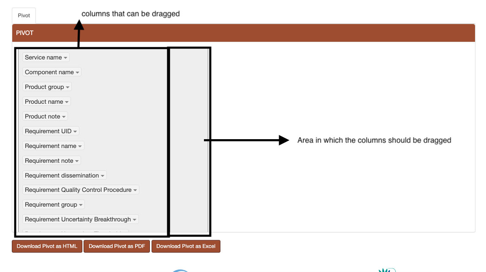

    *Report pivot - before dragging columns*

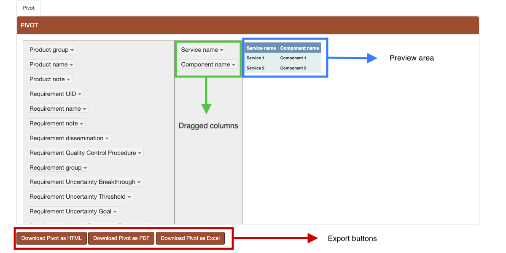

    *Report pivot - after dragging columns*

-----------------------
Filtering data in Pivot
-----------------------
The data in the table can also filtered by clicking on the arrow next to the column name (*Figure 19*).

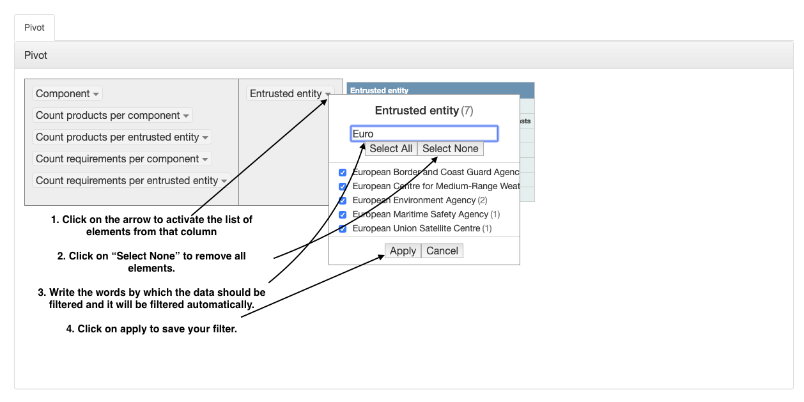

    *Report pivot - filter the data in the table*

---------------
Special reports
---------------
The special reports are spreadsheet files that have unmerged cells and can be filtered afterwards with specialized tools.
Those reports can be found on the  Report's list page, on the top of the page. For each report there is a description explaining
what type of data each report contains.

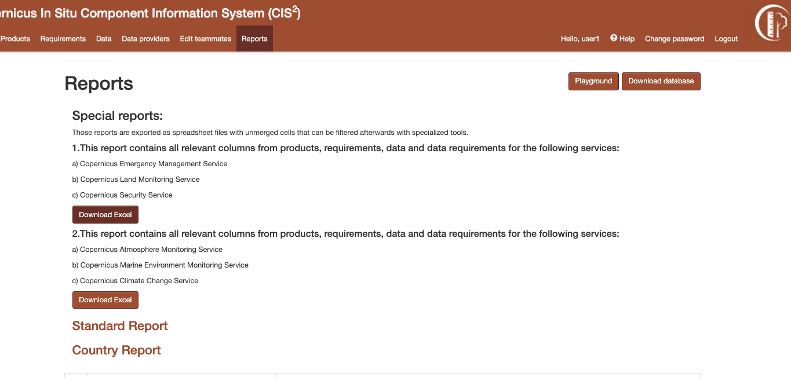

    *Special reports*

---------------
Standard Report
---------------
The application also generates Standard Reports. Those reports present data that is filtered against
the components of the 3 following services: Copernicus Emergency Management Service, Copernicus Land Monitoring Service
and Copernicus Securiy Service. One exception is available for the For the Global Land Component as only 2 products are
filtered for it ( the Hot Spot Monitoring - Land Cover and Hot Spot Monitoring - Land Cover Change products) .

The Standard Report is available under the Reports tab from the navigation menu followed by clicking
on the link "Standard Report".

The user can then select one or more Components from the second dropdown to filter the data against. The first
dropdown, Service, is used to filter the Components in the second dropdown in order to better identify which component is part of which service.
(*Figure 21*)
After setting the filters, the user has the option to either generate the Standard Report as a PDF or as an Excel file.
The file will contain details regarding the component(s) that the data was filtered against and the date and time at which
the report was generated.

    *Standard report*

Administration
==============

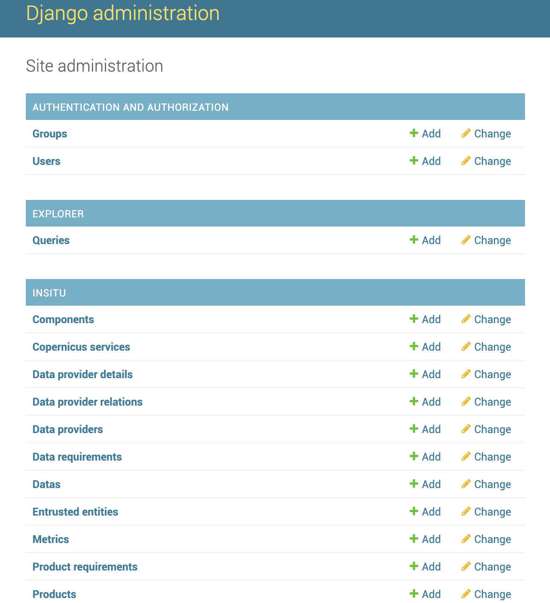

    *Administrator panel*

The administration panel can be accessed only by a user who has administration rights. Here, all objects, relations and
picklists values can be modified without countraints.

Help page
=========

The help page describes each value in the dropdowns used to fill the objects.
The help page can be accessed from the navigation menu by clicking “Help”. In the forms, the dropdown fields have
attached a question mark. By clicking on that question mark you will access the help page.

    *An example table from help page*

For Example, in *Figure 23* is one of the tables available on the Help page. Under the table title there is a small
description of that field’ s purpose. In the table there is the name of each value and the description of what that value
represents.

Management
==========

    *Management section*

The management section is accessible only to an user with administration rights. This section can be used to export all
picklists or all products as an excel document. In order to import picklists or products, the user must first export
them, edit the exported spreadsheet and then import it.

Statistics about the data can also be extracted on this page. The user can check, for a selectable period of time,
how many objects were active, how many objects were created and how many objects were updated.
The user has to select a start date for the period, an end date and the objects type they want the data to be
shown for.

Logging actions
===============

All editing actions done by users are logged in a log file. That includes: editing, adding or deleting any object from the application
will be stored. The log gives informations about the user, the action the user made and the object that was accessed.

Soft deletion
=============

The objects and relations are never deleted. They are instead marked as “deleted”. The objects can be permanently deleted
only by accessing the database directly.

